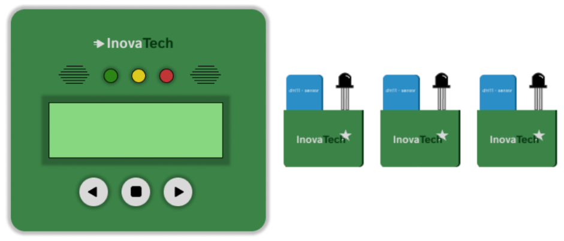
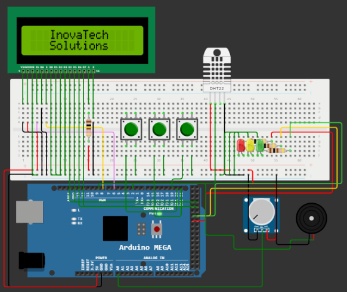
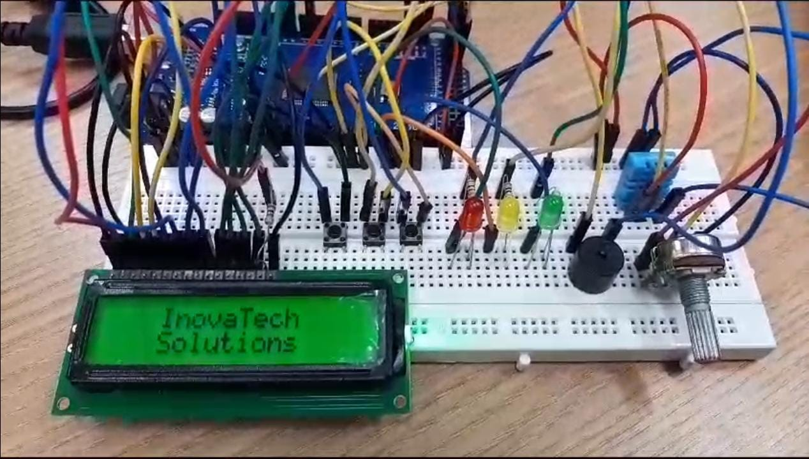

# Equipamento de Monitoramento Ambiental

O projeto do dispositivo de monitoramento ambiental tem como objetivo criar um sistema que realize monitoramento contínuo das condições de um almoxarifado de armazenamento de medicamentos, abrangendo as seguintes especificações:

>- Medição de Temperatura
>- Medição de Umidade
>- Detecção de Incêndio
>- Botão de Controle
>- Display de LCD
>- 3 Modos de Configuração
>- Guardar registros de medições

Com o objetivo do trabalho em mente, um código em C criado foi criado para controlar um display LCD usando um microcontrolador AVR. O código está configurado para utilizar um microcontrolador com portas de saída e temporização para controlar o display LCD.

| Manipulação dos Registradores no Arduino Mega |
|-------------------------------|
||

## 🤖 Descrição do código:
O projeto inclui um código que faz uso de [funções nativas](src/code-native-comands) do Arduino, bem como outro código que envolve a [manipulação direta de registradores](src/code-registrars-comands). A seguir, encontra-se a descrição do código de manipulação direta de registradores, utilizado na simulação do sistema.

>1. Inclusão de bibliotecas
>2. Definição de constantes
>3. **Função pulse_E()** com a função de criar um pulso no pino E (Enable) para sincronizar os dados enviados ao LCD.
>4. **Função cmd_LCD(unsigned char c, char cd)** para enviar comandos ou dados ao LCD.
>    - 'c' é o byte de comando ou dado a ser enviado.
>    - 'cd' é um indicador que determina se você está enviando um comando (0) ou um dado (1) para o LCD.
>    - A função configura os pinos RS de acordo com 'cd' e, em seguida, envia os dados em formato de 4 bits ou 8 bits, dependendo da configuração de 'nibble_dados'.
>5. Funções responsáveis por armazenar dados de umidade e temperatura, e lidar com sinais do sensor DHT22 (ou DHT11)
>6. Função **start()** é usada para inicializar as configurações do sistema com os comandos necessários, como a seleção do modo de 4 bits. Nela configura-se as portas necessárias como saídas, habilita interrupções e prepara o display LCD.
>7. Funções **show_LCD()** e **show_LCD_number()** usadas para exibir texto e números no LCD.
>8. A função **posicionar_cursor()** para posicionar o cursor do LCD em uma linha e coluna específicas.
>9. O código inclui várias funções que controlam as diferentes telas do sistema, como a tela principal que mostra a umidade e temperatura, a tela de configuração e as telas de configuração de limites (mínimos e máximos) de umidade e temperatura.
>10. A função **alert_led()** que lida com a sinalização de alertas usando um buzzer e LEDs, dependendo das condições de umidade e temperatura em relação aos limites configurados.
>11. **Função main()** onde o programa executa as funções conforme a necessidade e entra em um loop infinito com 'while (1);', mantendo o LCD exibindo a mensagem.
>12. O código também possui interrupções que permitem ao microcontrolador suspender temporariamente o programa principal para lidar com eventos externos, como acionamento de botões, detecção de alterações em sensores e tarefas periódicas.

## 🖥️ Comandos padrões para displays LCD:

| Comando Hexadecimal | Comando Decimal | Função                                                                                                  |
|---------------------|-----------------|---------------------------------------------------------------------------------------------------------|
| 0x01                | 1               | Limpar o display e retornar o cursor para a posição inicial.                                           |
| 0x02                | 2               | Retornar o cursor para a posição inicial sem apagar o display.                                          |
| 0x04                | 4               | Ativar/desativar o cursor piscante (cursor intermitente).                                               |
| 0x06                | 6               | Configurar o modo de entrada para mover o cursor para a direita após a escrita de um caractere.       |
| 0x05                | 5               | Configurar o modo de entrada para mover o cursor para a esquerda após a escrita de um caractere.      |
| 0x0C                | 12              | Ativar/desativar a exibição do cursor (cursor invisível ou visível sem piscar).                         |
| 0x10                | 16              | Mover o cursor para a esquerda.                                                                         |
| 0x14                | 20              | Mover o cursor para a direita.                                                                         |
| 0x18                | 24              | Deslocar o display para a esquerda (o texto move-se, o cursor permanece no lugar).                    |
| 0x1C                | 28              | Deslocar o display para a direita (o texto move-se, o cursor permanece no lugar).                    |
| 0x20                | 32              | Selecionar o modo de comunicação de 4 bits (nibble) em vez de 8 bits.                                   |
| 0x30                | 48              | Selecionar o modo de comunicação de 8 bits.                                                             |
| 0x38                | 56              | Configurar o LCD para operação de 2 linhas e caracteres de 5x8 pixels (configuração padrão).           |
| 0x40                | 64              | Configurar o LCD para operação de 1 linha e caracteres de 5x8 pixels.                                  |
| 0x80                | 128             | Posicionar o cursor na primeira linha e na primeira coluna (início).                                   |
| 0xC0                | 192             | Posicionar o cursor na segunda linha e na primeira coluna.                                             |
| 0x90                | 144             | Posicionar o cursor na primeira linha e na quinta coluna.                                              |
| 0xD0                | 208             | Posicionar o cursor na segunda linha e na quinta coluna.                                               |

## Design do Modelo

| Dispositivo de monitoramento e sensores - InovaTech |
|-----------------------------------------------------|
||

O designer do dispositivo de monitoramento ambiental é uma solução funcional e versátil, projetada para oferecer informações precisas e acessíveis sobre as condições ambientais. Com três botões intuitivos, a configuração do dispositivo é simplificada, permitindo que os usuários personalizem facilmente as configurações. Os três LEDs coloridos - vermelho, amarelo e verde - fornecem uma representação visual instantânea das medições do sensor. O LED vermelho indica alertas de condições ambientais fora dos níveis estipulados, enquanto o amarelo sinaliza condições próximas dos limites e o verde indica condições seguras dentro dos parâmetros desejados.

Além disso, o dispositivo é equipado com um buzzer que emite um som audível apenas em situações de alerta vermelho, aprimorando a capacidade de alertar os usuários sobre condições críticas do ambiente. O display LCD 16x2 oferece uma visualização clara das informações de temperatura e umidade, tornando a leitura e interpretação dos dados simples e acessível.

Este dispositivo oferece duas opções de sensores para atender às necessidades específicas dos usuários. O modelo com o sensor DHT22 mede com precisão temperatura e umidade, enquanto o modelo com o DHT11 é uma alternativa econômica que ainda oferece informações essenciais para o monitoramento ambiental. 
Além disso, o sensor de fumaça integrado permite o monitoramento de incêndio, tornando este dispositivo uma solução completa para a segurança e o acompanhamento das condições ambientais em uma variedade de cenários.

## 🚀 Simulação do Sistema

A implementação do projeto foi inicialmente simulada na plataforma [Wokwi](https://wokwi.com/) e posteriormente montada. Os resultados podem ser comprovados pelas imagens e vídeos disponibilizados neste tópico.

| Simulação realizada no Wokwi | Montagem do circuito realizado |
|------------------------------|--------------------------------|
|||

Para a montagem do circuito foram utilizados os seguintes componentes:
- Arduino-Mega 2560
- Sensor de umidade e temperatura (DHT11)
- Potenciômetro, simulando sensor de gás
- Push button
- Display LCD (16x2)
- LEDs
- Protoboard

Para visualizar uma simulação do sistema de monitoramento ambiental em ação, confira [este link](https://www.loom.com/share/657320af3b4c44f0aaf78eeba94cd8a4?sid=b937ec63-254c-4ddb-9b63-85fcbb1e88e6). A simulação demonstra o funcionamento do equipamento, incluindo a medição de temperatura, umidade, e outras funcionalidades. 

## ✍️ Authors

- [Quelita Míriam](https://github.com/quelita2) 👩🏼‍💻
- [Thiago Lopes](https://github.com/thiagonasmto) 🧑🏼‍💻

---

  DCA0119 - Digital Systems (2023.2)  
  Federal University of Rio Grande do Norte - Department of Computer and Automation Engineering (DCA).

